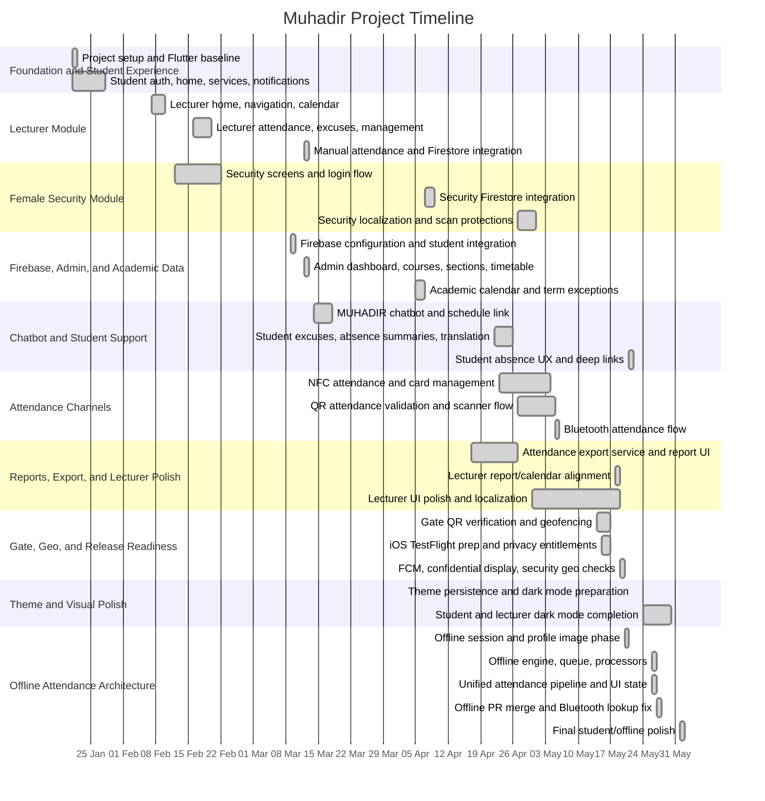

# Muhadir Gantt Chart

This chart is derived from commit activity between 2026-01-21 and 2026-06-01.

## Milestones

| Date | Milestone |
| --- | --- |
| 2026-01-21 | Project initialized and first student-facing shell created |
| 2026-02-22 | Female security feature merged into main history |
| 2026-03-13 | Admin data, sections, schedules, and lecturer manual attendance became active |
| 2026-04-17 | Attendance export work started |
| 2026-04-27 | Lecturer QR attendance session flow connected |
| 2026-05-06 | Bluetooth attendance flow reached submission support |
| 2026-05-17 | Gate, geo, and TestFlight readiness work completed for the sprint |
| 2026-05-27 | Offline attendance feature branch merged |
| 2026-06-01 | Student UI and offline attendance hardening polished |
